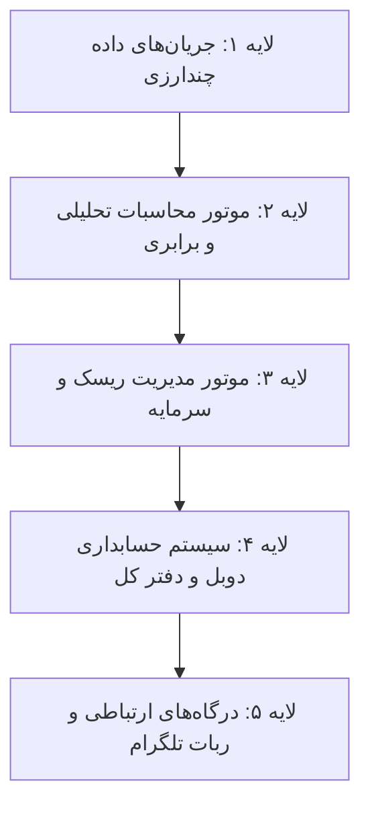

# پلتفرم شبیه‌ساز انباشت سیستماتیک طلا (Dynamic Gold DCA Framework)

> **نسخه پژوهشی و اثبات مفهوم (Research & Proof-of-Concept Demo)**  
> این مخزن شامل پیاده‌سازی متدولوژی پایه‌ای انباشت دارایی بر مبنای میانگین‌سازی هزینه (Dollar-Cost Averaging) در شرایط تورم ساختاری و نوسانات بازار فیزیکی طلا است.

[](https://github.com/Shayan-Ganji/gold-dca-framework)
[](http://204.11.2.236:8501)
[](https://t.me/TalaOracle_Bot)
[](https://www.python.org/)
[](https://www.docker.com/)

---

## 📌 یادداشت مهم و بیانیه محرمانگی تجاری (Confidentiality Notice)

کدبیس و داشبورد حاضر، **صرفاً یک نسخه نمایشی (MVP / Demonstration)** از ایده پژوهشی انباشت بلندمدت طلا است.  
**پلتفرم عملیاتی اصلی (Production Trading & Financial Accounting Platform)** که به صورت خصوصی (Private) توسعه یافته و میزبانی می‌شود، شامل ویژگی‌های اختصاصی زیر بوده و به دلایل حفاظت از مالکیت فکری در دسترس عمومی قرار ندارد:

- اتوماسیون جریان سفارشات زنده و تطبیق مظنه‌های بنکداری نقدی
- موتور اختصاصی ارزش‌گذاری و محاسبات بلادرنگ انحراف ارزش
- سیستم حسابداری دوبل (Double-Entry Ledger) و تسویه حساب طرف‌های تجاری
- موتور کنترل ریسک چندلایه‌ای و حد ضرر متحرک (Trailing Stop-Loss)
- زیرساخت پایش بلادرنگ و هشداردهی اختصاصی

---

## 💡 مسئله پژوهشی: انباشت طلا در محیط‌های تورمی

در اقتصادهای با تورم ساختاری، نگهداری نقدینگی ریالی با کاهش شدید قدرت خرید همراه است. از سوی دیگر، ورود یکباره به بازار در پیک‌های قیمتی یا خرید با فواصل زمانی ثابت بدون توجه به حباب‌های موضعی، ریسک کاهش ارزش سبد در اصلاح‌های بازار را افزایش می‌دهد.

این پژوهش متدولوژی **انباشت پویا (Dynamic Value-Aware DCA)** را مدل‌سازی می‌کند:
1. **تخصیص متغیر بودجه:** کاهش سهم خرید در فازهای رشد نامتعارف (حباب قیمتی) و ذخیره‌سازی نقدینگی در صندوق احتیاط.
2. **تزریق نقدینگی در تخفیف‌ها:** افزایش سهم خرید در اصلاح‌های تکنیکال جهت کاهش بهای تمام‌شده موزون (WAC).
3. **کاهش حداکثر افت سرمایه (Drawdown Reduction):** ایجاد یک حاشیه امنیت (Margin of Safety) پایدار در مقایسه با خرید یکجا (Lump Sum) یا انباشت کور با فواصل ثابت.

---

## 🏗️ معماری کلی سامانه عملیاتی (High-Level Architecture)



1. **لایه دریافت داده (Data Ingestion):**  
   پایش پیوسته مظنه آبشده بازار تهران، سکه بهار آزادی/امامی، نرخ انس جهانی طلا (XAU/USD) و دلار/تتر بازار آزاد همراه با فیلتر داده‌های پرت و همگام‌سازی لحظه‌ای.
2. **لایه تحلیل و برابری ارزش (Analytical Engine):**  
   محاسبه لحظه‌ای ارزش ذاتی مظنه، استخراج حباب اسمی/درصدی مسکوکات و ارزیابی رژیم‌های نوسان.
3. **لایه مدیریت ریسک (Risk Controls):**  
   تنظیم خودکار حد ضرر متحرک بر مبنای دامنه نوسان، تعیین اهداف ذخیره سود پله‌ای و پایش سقف تعهدات نقدینگی.
4. **لایه حسابداری دوبل و مدیریت پوزیشن (Financial Ledger):**  
   ثبت فاکتورهای بنکداری، تهاتر مطالبات، ثبت اسناد انبار/وثایق، رهگیری بهای تمام‌شده هر گرم و نقطه سر‌به‌سر.
5. **لایه ارتباطی و ربات تلگرام (Multi-Tier Gateway):**  
   ارائه خدمات چندسطحی (کاربر عادی، شرکای سرمایه‌گذار، و کاربران ویژه با احراز هویت رمزنگاری‌شده).

---

## 🤝 مدل شراکت و استخر سرمایه‌گذاری (Investment Partnership Pool)

پلتفرم عملیاتی از ساختار تجمیع سرمایه جهت مشارکت سرمایه‌گذاران همراه با الزامات شفافیت مالی پشتیبانی می‌کند:

- **تسهیم بر مبنای سهم واقعی (Pro-Rata Attribution):** محاسبه سود و زیان دوره‌ای دقیقا بر پایه نسبت سرمایه اولیه هر شریک به کل سرمایه در گردش پوزیشن‌ها.
- **حسابداری تفکیکی:** ارائه گزارش‌های ادواری از سود محقق‌شده، سود تحقق‌نیافته و ارزش اسمی کل سبد.
- **پنل تلگرامی شرکا:** امکان استعلام لحظه‌ای مانده‌ها، سهم سود و وضعیت معاملات جاری بدون دسترسی به تنظیمات اجرایی.
- **ثبت درخواست:** علاقه‌مندان به مشارکت می‌توانند از طریق ربات تلگرام [@TalaOracle_Bot](https://t.me/TalaOracle_Bot) و بخش «شرکای سرمایه‌گذار» فرم مربوطه را ارسال فرمایند.

---

## 👥 معرفی تیم و تفکیک مسئولیت‌ها (Team & Roles)

این پروژه حاصل همکاری تخصصی در دو حوزه فنی و محصولی است:

### 🔹 توسعه‌دهنده هسته فنی و معمار سیستم (Lead Engineer & Systems Architect) - شایان گنجی
- **طراحی مدل‌های کمّی و الگوریتم‌های محاسباتی:** پیاده‌سازی شبیه‌ساز انباشت، مدل‌های توازن ارزش، و محاسبات آماری نوسان.
- **توسعه بک‌اند و وب‌سرویس‌ها:** طراحی و پیاده‌سازی APIهای REST با FastAPI و مدیریت پایگاه داده رابطه‌ای.
- **طراحی سیستم حسابداری و دفتر کل:** مهندسی دفتر کل دوبل، منطق تسویه حساب، ثبت تهاترها و محاسبات میانگین موزون بهای تمام‌شده.
- **پایپ‌لاین‌های تجمیع داده:** مهندسی جریان داده‌های چندارزی بلادرنگ و مکانیزم‌های بازیابی خطا.
- **سامانه‌های کنترل ریسک و اتوماسیون:** طراحی حد ضرر متحرک، تریگرهای اتوماتیک و هشدارهای سرور.
- **زیرساخت سرور و استقرار ابری:** مدیریت سرورهای عملیاتی (Docker, Nginx, Linux, Systemd).

### 🔹 طراحی اولیه فرانت‌اند و ایده‌پردازی محصول (Frontend Prototyping & Ideation) - هادی گلی (Hadi Goli)
- **پیاده‌سازی ساختار اولیه رابط کاربری:** نمونه‌سازی و طراحی چیدمان اولیه داشبورد کاربری.
- **طراحی بصری و المان‌های رابط کاربری:** تعریف تم ظاهری و هماهنگی ویژوال کامپوننت‌ها.
- **ایده‌پردازی نیازمندی‌های محصولی:** ارائه تجربیات تجاری بازار فیزیکی طلا، تعریف سناریوهای کاربردی و استخراج نیازهای تعامل با سرمایه‌گذاران.

---

## 🚀 نحوه اجرای نسخه دمو (Run Demo Locally)

این داشبورد دمو کاملاً مستقل بوده و به هیچ داده محرمانه‌ای وابسته نیست:

```bash
# کلون کردن مخزن دمو
git clone https://github.com/Shayan-Ganji/gold-dca-framework.git
cd gold-dca-framework

# اجرا با داکر کامپوز
docker compose up -d --build

# اجرا با داکر کامپوز (معماری مدرن React 19 + FastAPI + Nginx)
docker compose up -d --build
```

پس از اجرا، داشبورد در آدرس `http://localhost:8501` در دسترس خواهد بود.

---

## 🌐 لینک‌های دسترسی (Live Links)

- **مخزن رسمی گیت‌هاب دمو:** [https://github.com/Shayan-Ganji/gold-dca-framework](https://github.com/Shayan-Ganji/gold-dca-framework)
- **شبیه‌ساز زنده انباشت (Germany Host):** [http://204.11.2.236:8501](http://204.11.2.236:8501)
- **ربات رسمی پایش و اعلان تلگرام:** [@TalaOracle_Bot](https://t.me/TalaOracle_Bot)
