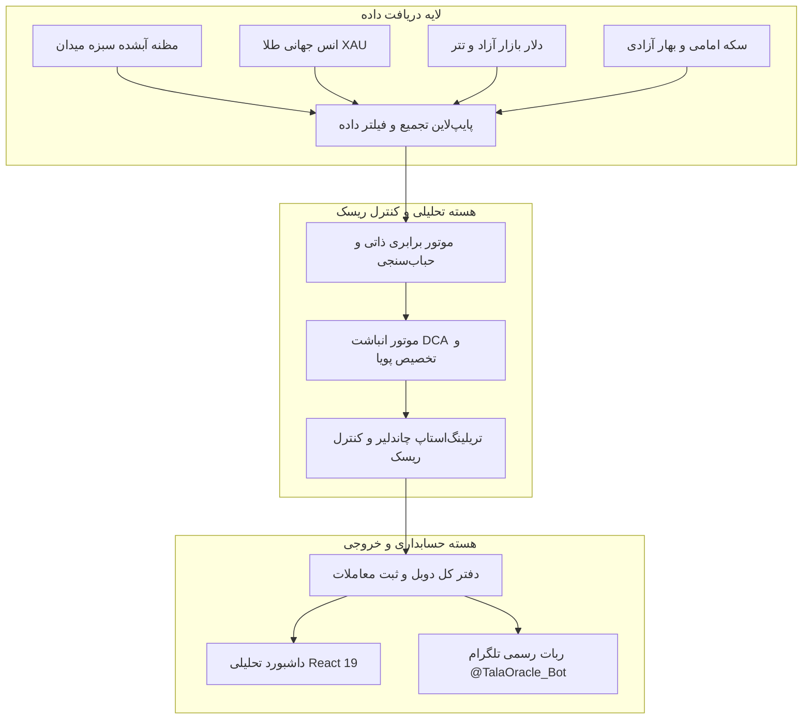
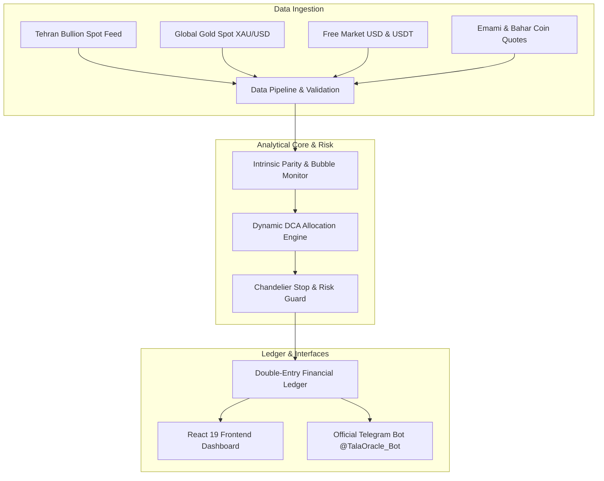

# 🪙 Dynamic Gold DCA Framework & Quantitative Asset Allocation Platform
### سامانه مدیریت کمّی دارایی و چارچوب انباشت سیستماتیک طلا

[](https://github.com/Shayan-Ganji/gold-dca-framework)
[](http://204.11.2.236:8501)
[](https://t.me/TalaOracle_Bot)
[](https://www.python.org/)
[](https://react.dev/)
[](https://www.docker.com/)

---

<div align="center">

### 🌐 انتخاب زبان / Select Language

<a href="#-بخش-اول-مستندات-جامع-به-زبان-فارسی">
  
</a>
&nbsp;&nbsp;&nbsp;&nbsp;
<a href="#-section-2-complete-english-documentation">
  
</a>

<p><em>(جهت جابه‌جایی سریع میان زبان‌ها روی دکمه‌های بالا کلیک کنید / Click the buttons above to switch languages)</em></p>

---

</div>

<br/>

---

# 🇮🇷 بخش اول: مستندات جامع به زبان فارسی

[English Version 🇬🇧](#-section-2-complete-english-documentation) | [بازگشت به بالا ⬆️](#dynamic-gold-dca-framework--quantitative-asset-allocation-platform)

---

## 📌 ۱. بیانیه محرمانگی تجاری و تفاوت نسخه دمو با پلتفرم عملیاتی

کدبیس و داشبورد موجود در این مخزن، **صرفاً یک نسخه نمایشی و اثبات مفهوم (Proof-of-Concept / Showcase Demo)** از مدل انباشت سیستماتیک طلا است.  

> [!IMPORTANT]
> **پلتفرم عملیاتی اصلی (Production Trading & Financial Accounting Engine)** که به‌صورت خصوصی (Private) توسعه یافته و میزبانی می‌شود، شامل امکانات زیرساختی زیر بوده و به دلایل صیانت از مالکیت فکری و امنیت سرمایه، در دسترس عمومی قرار ندارد:
> - **پایش ۶۰ متغیر کمّی و کلان:** نرخ‌های برابری، سرعت گردش نقدینگی، شکاف‌های حباب و تکانه‌های بین‌بازاری به‌صورت ساب‌سکند (Sub-Second).
> - **موتورهای اختصاصی پیش‌بینی و سوپرسایکل:** مدل‌های یادگیری ماشین تلفیقی (Dual-Horizon Ensemble)، فیلترهای گیت‌شده نوسان‌سنج و رادارهای خروج هوشمند.
> - **سیستم حسابداری دوبل پیشرفته (Double-Entry Ledger):** تسویه بلادرنگ با بنکداری‌های سبزه میدان، تهاتر طلا و ریال، حسابداری کارمزدها و ثبت اسناد انبار/وثیقه.
> - **کنترل ریسک چندلایه‌ای:** تریلینگ‌استاپ سه‌مرحله‌ای (Trailing Stop-Loss)، چاندلیر پارابولیک و اهداف ذخیره سود پلکانی.
> - **داده‌ها و لاگ‌های ترید واقعی:** تمامی سوابق معاملاتی، لاگ‌ها و دیتابیس‌های حقیقی در محیط خصوصی محافظت می‌شوند و این دمو صرفاً با داده‌های سنتتیک و عمومی عمل می‌کند.

---

## 💡 ۲. مسئله پژوهشی: انباشت طلا در اقتصادهای تورمی

در شرایط تورم ساختاری و افت ارزش پول فیات، نگهداری ریال موجب فرسایش شدید دارایی می‌شود. با این حال، خرید یکباره (Lump Sum) در سقف‌های قیمتی نیز به دلیل ماهیت نوسانی بازار و جهش‌های غیرخطی طلا، ریسک افت موقت سرمایه (Drawdown) سنگینی به همراه دارد.

این چارچوب، استراتژی **انباشت پویا بر پایه ارزش (Dynamic Value-Aware DCA)** را مدل‌سازی می‌کند:
1. **تزریق نقدینگی در تخفیف‌های تاریخی:** خرید پرحجم‌تر طلا در زمان‌هایی که قیمت زیر ارزش ذاتی منصفانه یا در اصلاح‌های تکنیکال قرار دارد.
2. **کاهش خرید در فازهای حباب مثبت:** ذخیره نقدینگی در زمان کشیدگی غیرعادی قیمت نسبت به ارزش برابری انس و دلار.
3. **پدیده درو نوسان (Volatility Harvesting):** ایجاد حاشیه امنیت پایدار (Margin of Safety) و کاهش بهای تمام‌شده موزون به ازای هر گرم نسبت به قیمت روز بازار.

---

## 📐 ۳. متدولوژی محاسباتی و فرمول‌های ریاضی

### ۱. میانگین وزنی بهای تمام‌شده (Weighted Average Cost - WAC):
$$ar{P} = \frac{\sum_{i=1}^n P_i \cdot Q_i}{\sum_{i=1}^n Q_i} = \frac{C_{\text{total}}}{\sum_{i=1}^n \frac{C_i}{P_i}}$$
که در آن $P_i$ قیمت هر گرم در پله $i$ام، $Q_i$ وزن طلای خریداری‌شده و $C_i$ سرمایه ریالی تخصیص‌یافته است.

### ۲. برابری ارزش ذاتی مظنه آبشده (Intrinsic Mazaneh):
$$\text{Mazaneh}_{\text{intrinsic}} = \frac{\text{XAU (USD/oz)} \times \text{USD/IRR}}{9.5742}$$
$$\text{Bubble}\% = \left( \frac{\text{Mazaneh}_{\text{market}}}{\text{Mazaneh}_{\text{intrinsic}}} - 1 \right) \times 100$$

### ۳. ارزش ذاتی سکه بهار آزادی و امامی:
$$\text{Coin}_{\text{intrinsic}} = \frac{\text{XAU} \times \text{USD} \times 0.900 \times 8.133}{31.1035} + \text{Zarb}$$

---

## 🏗️ ۴. معماری سامانه عملیاتی (System Architecture)



---

## 🤝 ۵. مدل شراکت و استخر سرمایه‌گذاری (Investment Partnership Pool)

پلتفرم عملیاتی از ساختار حسابداری تفکیکی برای سرمایه‌گذاران حقیقی و حقوقی پشتیبانی می‌کند:
- **تسهیم به نسبت سرمایه (Pro-Rata Attribution):** محاسبه دوره‌ای سود و زیان دقیقاً بر اساس مانده سرمایه در گردش هر شریک.
- **شفافیت گزارش‌دهی:** ارسال خودکار صورت‌وضعیت دارایی، بهای تمام‌شده موزون، طلاهای موجود در انبار/وثیقه و ارزش روز پرتفوی.
- **ثبت درخواست مشارکت:** علاقه‌مندان به همکاری می‌توانند از طریق ربات تلگرام [@TalaOracle_Bot](https://t.me/TalaOracle_Bot) و بخش «شرکای سرمایه‌گذار» با تیم مدیریت در ارتباط باشند.

---

## 👥 ۶. اعضای تیم و تفکیک مسئولیت‌ها

* **شایان گنجی (Lead Engineer & Systems Architect):**
  - طراحی مدل‌های کمّی، الگوریتم‌های محاسباتی DCA، برابری دارایی‌ها و ریاضیات انباشت.
  - توسعه کامل معماری بک‌اند (FastAPI)، وب‌سرویس‌ها، جریان داده‌های چندارزی و سیستم‌های کنترل ریسک.
  - مهندسی سیستم حسابداری دوبل و تسویه حساب طرف‌های تجاری.
  - استقرار ابری سرورها، خطوط CI/CD و زیرساخت داکر.
* **هادی گلی (UI Prototyping & Product Ideation):**
  - نمونه‌سازی اولیه صفحات و طراحی ویژوال کامپوننت‌های رابط کاربری.
  - ایده‌پردازی تجاری، استخراج نیازهای عملیاتی بازار فیزیکی طلا و الزامات تعامل با سرمایه‌گذاران.

---

## 🚀 ۷. اجرای محلی نسخه دمو

```bash
# ۱. کلون کردن مخزن
git clone https://github.com/Shayan-Ganji/gold-dca-framework.git
cd gold-dca-framework

# ۲. اجرای کامل استک با داکر کامپوز (React 19 + FastAPI + Nginx)
docker compose up -d --build
```
داشبورد روی پورت `http://localhost:8501` بالا خواهد آمد.

<br/>

---

# 🇬🇧 Section 2: Complete English Documentation

[Persian Version 🇮🇷](#-بخش-اول-مستندات-جامع-به-زبان-فارسی) | [Back to Top ⬆️](#dynamic-gold-dca-framework--quantitative-asset-allocation-platform)

---

## 📌 1. Confidentiality Notice & Demo Scope

The codebase and interface provided in this repository serve strictly as a **Proof of Concept (PoC) and Showcase Demo** for the systematic gold accumulation framework.

> [!IMPORTANT]
> **The Proprietary Production Platform** is privately operated and maintained. To safeguard intellectual property, sensitive business logic, and capital management mechanisms, the following core features are intentionally omitted from this public demo:
> - **Sub-Second 60+ Variable Macro Telemetry:** Real-time cross-asset parity, velocity spreads, and cross-market momentum.
> - **Dual-Horizon Ensemble Predictive Models:** Proprietary hybrid models, market regime switches, and squeeze indicators.
> - **Institutional Double-Entry Ledger:** Settlement matching with bullion dealers, physical vault tracking, and collateral accounting.
> - **Three-Stage Trailing Risk Management:** Chandelier parabolic stops, volatility-adjusted protective boundaries, and tiered profit preservation.
> - **Real Trade Records & Accounts:** All live trading databases (`portfolio.db`) and account balances remain secured in the production environment.

---

## 💡 2. The Economic Thesis: Systematic Gold DCA in Inflationary Environments

In structural inflation regimes with persistent fiat currency depreciation, holding cash yields continuous loss of purchasing power. Conversely, all-at-once (Lump Sum) allocation during local market euphoria carries extreme drawdown risk due to high volatility and non-linear market shocks.

This research formulates a **Dynamic Value-Aware Dollar-Cost Averaging (DCA)** methodology:
1. **Value-Driven Scaling:** Increasing allocation weight when gold trades at an intrinsic discount or during statistical pullbacks.
2. **Bubble-Aware Liquidity Preservation:** Tapering purchases and accumulating reserve liquidity when local prices detach from fundamental global parity.
3. **Volatility Harvesting (Shannon's Demon Effect):** Achieving a lower Weighted Average Cost (WAC) per gram than the spot market price, creating a structural margin of safety.

---

## 📐 3. Quantitative Formulations

### 1. Weighted Average Cost (WAC):
$$\bar{P} = \frac{\sum_{i=1}^n P_i \cdot Q_i}{\sum_{i=1}^n Q_i} = \frac{C_{\text{total}}}{\sum_{i=1}^n \frac{C_i}{P_i}}$$
Where $P_i$ denotes spot price at tranche $i$, $Q_i$ denotes accumulated grams, and $C_i$ is fiat capital allocated.

### 2. Intrinsic Mazaneh Parity:
$$\text{Mazaneh}_{\text{intrinsic}} = \frac{\text{XAU (USD/oz)} \times \text{USD/IRR}}{9.5742}$$
$$\text{Bubble}\% = \left( \frac{\text{Mazaneh}_{\text{market}}}{\text{Mazaneh}_{\text{intrinsic}}} - 1 \right) \times 100$$

### 3. Emami Gold Coin Fair Parity:
$$\text{Coin}_{\text{intrinsic}} = \frac{\text{XAU} \times \text{USD} \times 0.900 \times 8.133}{31.1035} + \text{Seigniorage}$$

---

## 🏗️ 4. System Architecture



---

## 🤝 5. Investment Partnership Pool

The production engine incorporates an institutional pooling framework designed for high-net-worth individuals and corporate partners:
- **Pro-Rata Attribution:** Profit and loss distribution strictly proportional to initial capital contributions.
- **Dedicated Partner Telemetry:** Real-time visibility into unrealized PnL, physical bullion inventory, and audited ledger statements.
- **Partner Access:** Prospective investors can initiate partner registration via the official Telegram bot [@TalaOracle_Bot](https://t.me/TalaOracle_Bot).

---

## 👥 6. Team & Key Roles

* **Shayan Ganji (Lead Engineer & Systems Architect):**
  - Quantitative modeling, DCA accumulation formulas, and cross-asset parity engines.
  - End-to-end backend architecture (FastAPI), real-time financial pipelines, and risk control infrastructure.
  - Design and development of the double-entry accounting ledger.
  - Server administration, CI/CD, and Docker container orchestration.
* **Hadi Goli (UI Prototyping & Product Ideation):**
  - Initial user interface layouts and visual component prototyping.
  - Product requirements definition and commercial domain expertise in physical gold trading.

---

## 🚀 7. Local Deployment

```bash
# 1. Clone repository
git clone https://github.com/Shayan-Ganji/gold-dca-framework.git
cd gold-dca-framework

# 2. Launch full-stack stack with Docker Compose (React 19 + FastAPI + Nginx)
docker compose up -d --build
```
Access the application at `http://localhost:8501`.

---

## 🌐 Official Access Links

* **Live Interactive Demo:** [http://204.11.2.236:8501](http://204.11.2.236:8501)
* **GitHub Repository:** [https://github.com/Shayan-Ganji/gold-dca-framework](https://github.com/Shayan-Ganji/gold-dca-framework)
* **Telegram Bot:** [@TalaOracle_Bot](https://t.me/TalaOracle_Bot)
